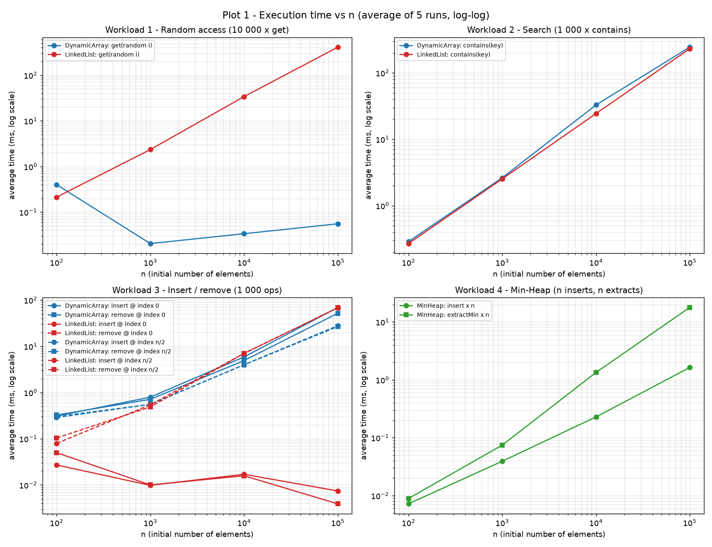
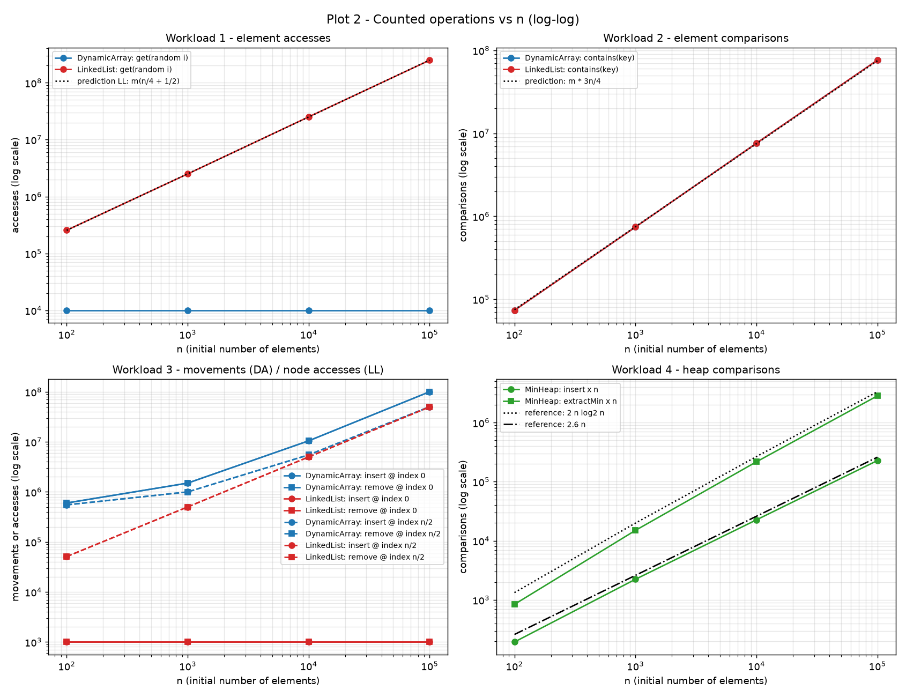
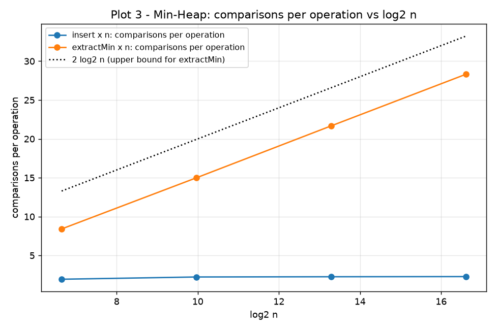
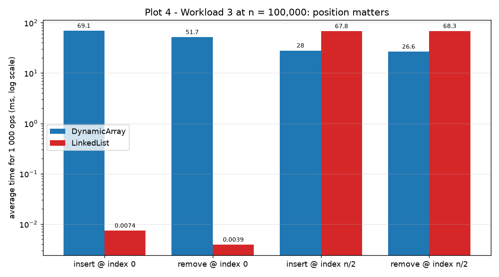

# Assignment 2 — Algorithmic Analysis, Correctness and Performance Trade-offs

## Repository structure

```
assignment-2/
├── src/
│   ├── SimpleList.java      # common interface of the two lists (used by tests and benchmark)
│   ├── DynamicArray.java    # resizable array (doubling strategy)
│   ├── LinkedList.java      # doubly linked list with head and tail
│   ├── MinHeap.java         # array-based binary min-heap
│   ├── Benchmark.java       # the four workloads, timing, counters, CSV/Markdown output
│   └── Tests.java           # correctness tests (edge cases + comparison with java.util)
├── scripts/
│   └── plot_results.py      # builds the plots from results/tables/all_results.csv
├── results/
│   ├── tables/              # all_results.csv, raw_runs.csv, one .md table per workload, environment.txt
│   ├── plots/               # plot1 … plot4 (.png)
│   └── benchmark_log.txt    # console output of the benchmark run
├── run.sh                   # compile → test → benchmark → plot
└── README.md
```

### How to run

```bash
./run.sh
# or step by step:
javac -d out src/*.java
java -cp out Tests
java -XX:+UseSerialGC -Xms1g -Xmx1g -cp out Benchmark results/tables
python3 scripts/plot_results.py        # needs matplotlib
python3 scripts/update_readme.py       # refreshes the result tables in this README
```

Requirements: JDK 17+ (tested with JDK 21 and 26), Python 3 with matplotlib for the plots.

**In IntelliJ IDEA:** mark `src` as Sources Root, run `Tests`, then create a run configuration for `Benchmark` with VM options `-XX:+UseSerialGC -Xms1g -Xmx1g`, program argument `results/tables` and the project folder as working directory. Afterwards run the two Python scripts in the IntelliJ terminal.

---

## 1. Overview

Three data structures were implemented from scratch in Java (no `java.util` collections inside them):

| Structure | Physical organisation | Operations |
|---|---|---|
| `DynamicArray<T>` | one contiguous `Object[]`, capacity doubles when full | `add(x)`, `add(i, x)`, `remove(i)`, `get(i)`, `contains(x)` |
| `LinkedList<T>` | doubly linked nodes, `head` and `tail` references; positional operations walk from the nearer end | same five operations |
| `MinHeap<T extends Comparable>` | complete binary tree stored in an array (`parent = (i-1)/2`, children `2i+1`, `2i+2`) | `insert(x)`, `peekMin()`, `extractMin()` |

Every structure has instrumentation counters (accesses, comparisons, movements / swaps) that are reset right before a timed section.
The goal of the assignment is not only the implementation but the comparison of **theoretical complexity** (O, Ω, Θ, loop-invariant proofs) with **measured behaviour** on four controlled workloads.

**Metric definitions used throughout the report**

| Counter | Meaning |
|---|---|
| accesses | number of elements (array) or nodes (list) touched to reach the target position; for the list = pointer hops + 1 |
| comparisons | number of element comparisons (`equals` in `contains`, `compareTo` in the heap) |
| movements | number of element copies in the array: shifts in `add(i,x)` / `remove(i)` + copies made during a resize |

---

## 2. Complexity Analysis

Notation: *n* = current number of elements, *i* = index argument. **O** is an upper bound, **Ω** a lower bound, **Θ** a tight bound (both). For each case (best / average / worst) the cost is a fixed function of *n*, so a Θ bound can be given; for the operation as a whole (over all inputs) the bound is written as O(worst) and Ω(best).

### 2.1 Complexity table

| Structure | Operation | Best | Average | Worst | Aux. space |
|---|---|---|---|---|---|
| Dynamic Array | `add(x)` | Θ(1) | Θ(1) amortized | Θ(n) (resize) | Θ(1) amortized, Θ(n) during resize |
| Dynamic Array | `add(i, x)` | Θ(1) (i = n) | Θ(n) | Θ(n) (i = 0) | Θ(1) (+ resize as above) |
| Dynamic Array | `remove(i)` | Θ(1) (i = n−1) | Θ(n) | Θ(n) (i = 0) | Θ(1) |
| Dynamic Array | `get(i)` | Θ(1) | Θ(1) | Θ(1) | Θ(1) |
| Dynamic Array | `contains(x)` | Θ(1) (first element) | Θ(n) | Θ(n) (absent) | Θ(1) |
| Linked List | `add(x)` | Θ(1) | Θ(1) | Θ(1) | Θ(1) (one new node) |
| Linked List | `add(i, x)` | Θ(1) (i = 0 or n) | Θ(n) | Θ(n) (i ≈ n/2) | Θ(1) (one new node) |
| Linked List | `remove(i)` | Θ(1) (i = 0 or n−1) | Θ(n) | Θ(n) (i ≈ n/2) | Θ(1) |
| Linked List | `get(i)` | Θ(1) (i = 0 or n−1) | Θ(n) | Θ(n) (i ≈ n/2) | Θ(1) |
| Linked List | `contains(x)` | Θ(1) | Θ(n) | Θ(n) | Θ(1) |
| Min-Heap | `insert(x)` | Θ(1) (x ≥ parent) | Θ(1) for random input (expected ≈ 2.6 comparisons) | Θ(log n) (new minimum) | Θ(1) amortized (array doubling) |
| Min-Heap | `peekMin()` | Θ(1) | Θ(1) | Θ(1) | Θ(1) |
| Min-Heap | `extractMin()` | Θ(1) (e.g. all keys equal) | Θ(log n) | Θ(log n) | Θ(1) (iterative sift-down) |

Space of the structures themselves: all three are Θ(n). The array may hold up to 2n slots after a resize; the list stores two extra references and an object header per element (≈ 24–32 bytes per node vs. 4–8 bytes per array slot).

### 2.2 Justification

**Dynamic Array.**
`get(i)` computes the address `base + i·size` directly, independent of *n* → Θ(1) in every case.
`add(i, x)` must shift the n − i elements after position *i* one slot to the right (proved in §3.1), `remove(i)` shifts n − 1 − i elements left. For a uniformly random *i* the expected shift is n/2 → Θ(n); the best case is the end of the array (0 shifts), the worst case index 0 (n shifts).
`add(x)` writes into the next free slot, Θ(1), except when the array is full: then all *n* elements are copied into an array of double size, Θ(n). Because capacity doubles, the resizes happen at sizes 8, 16, 32, …; the total copy work for *N* appends is 8 + 16 + … + N < 2N, so the **amortized** cost is Θ(1).
`contains(x)` is linear search: 1 comparison if *x* is first, *n* comparisons if *x* is absent; for a present key at a uniformly random position the expected number is (n+1)/2 → Θ(n).

**Linked List.**
There is no address arithmetic: position *i* is reached only by following pointers. Walking from the nearer end costs min(i, n−1−i) hops, which is 0 at both ends and n/2 in the middle; for random *i* the expectation is ≈ n/4 → Θ(n). The walk-from-nearer-end optimisation halves the constant but does not change the class.
Once the node is found, linking or unlinking changes a constant number of references → Θ(1). Therefore `add(i, x)`/`remove(i)` = Θ(position search) + Θ(1): Θ(1) at the ends, Θ(n) in the middle. No element is ever moved.
`contains(x)` is the same linear scan as in the array: Θ(1) best, Θ(n) average/worst.

**Min-Heap.**
The heap is a complete binary tree, so its height is ⌊log₂ n⌋.
`peekMin()` returns `heap[0]`, which is the minimum by the heap property → Θ(1).
`insert(x)` places *x* in the first free leaf and sifts it up; each iteration does 1 comparison and moves one level up, so at most ⌊log₂ n⌋ comparisons → O(log n). The worst case (a new minimum travels to the root) is Θ(log n); the best case (x ≥ parent) is Θ(1). For random keys most new elements stop after one or two levels (half of the nodes are leaves, a quarter are one level above), which gives an expected constant ≈ 2.6 comparisons — confirmed by Workload 4 (≈ 2.3 per insert).
`extractMin()` moves the last leaf to the root and sifts it down; each level costs ≤ 2 comparisons (choose the smaller child, compare with it), so ≤ 2⌊log₂ n⌋ comparisons. The moved element came from the bottom of the tree and is usually large, so it almost always sinks to the bottom again → Θ(log n) on average and in the worst case.

### 2.3 Operations that look similar but cost different amounts

* **`get(i)` in the array vs. the list.** Same signature, but Θ(1) vs. Θ(n): in Workload 1 at n = 100 000 the list touched ≈ 24 900 nodes per `get` while the array touched exactly 1.
* **`add(i, x)` in the array vs. the list.** Both are Θ(n) in the worst case, but for opposite reasons and at opposite positions: the array pays for *moving elements* (expensive at the front, free at the end), the list pays for *finding the position* (free at the ends, expensive in the middle).
* **`contains(x)` in both structures.** Identical algorithm and identical number of comparisons. In theory the list should be slower per comparison, because every step is a dependent pointer load (`node.next`) followed by a second load (`node.value`), while the array scans a contiguous block that the CPU prefetches. Workload 2 shows that in practice this difference can disappear (see §6).
* **`add(x)` (array)**: Θ(1) amortized but Θ(n) for the single call that triggers a resize — amortized and worst-case bounds are different statements.
* **`insert` vs. `extractMin` (heap)**: both are O(log n) in the worst case, but on random input `insert` is Θ(1) on average while `extractMin` is always Θ(log n) — in Workload 4 extraction was ≈ 12× more comparisons than insertion at n = 100 000.

---

## 3. Correctness (loop invariants)

### 3.1 `DynamicArray.add(index, x)` — shifting loop

```java
// precondition: 0 <= index <= size, capacity > size (ensured by ensureCapacity)
for (int i = size; i > index; i--) {
    data[i] = data[i - 1];
}
data[index] = x;
size++;
```

Let *s* = size before the call and **A[0..s−1]** the original contents.

**Invariant I(i).** At the start of every iteration (and at the final loop test), with the current value of *i* (index ≤ i ≤ s):
1. `data[0..i−1] = A[0..i−1]` — the prefix up to i−1 has not been modified;
2. `data[i+1..s] = A[i..s−1]` — the elements originally at positions i … s−1 have already been shifted one slot to the right.

**Initialization.** Before the first iteration i = s. Part 1: nothing has been written, so `data[0..s−1] = A[0..s−1]`. Part 2: the range `data[s+1..s]` is empty, so it holds trivially.

**Maintenance.** Assume I(i) holds and i > index, so the body executes `data[i] = data[i−1]`. Because i−1 ≤ i−1, part 1 gives `data[i−1] = A[i−1]`, so afterwards `data[i] = A[i−1]`. Together with part 2 this gives `data[i..s] = A[i−1..s−1]`, which is part 2 for i−1. Only cell *i* was written and it is outside `[0..i−2]`, so `data[0..i−2] = A[0..i−2]`, which is part 1 for i−1. After `i--` the invariant I(i−1) holds.

**Termination.** *i* starts at *s*, decreases by exactly 1 per iteration and the loop stops when i = index; therefore it runs exactly s − index times (finite; 0 times when index = s). At that moment I(index) holds:
`data[0..index−1] = A[0..index−1]` and `data[index+1..s] = A[index..s−1]`.

**Why this proves correctness.** After the loop, `data[index] = x` and `size = s + 1`, so the array is
`A[0], …, A[index−1], x, A[index], …, A[s−1]` —
exactly the sequence obtained by inserting *x* at position *index*: every original element appears once, in the original relative order, and *x* is at the requested position. The proof also gives the cost: exactly s − index element movements, i.e. Θ(n − index), which the `movements` counter reproduces exactly in Workload 3 (e.g. 100 499 500 movements = Σ(n + k) for k = 0…999 at n = 100 000).

`remove(index)` is proved symmetrically with the invariant "`data[index..i−1] = A[index+1..i]` and `data[i..s−1] = A[i..s−1]`" for the forward loop.

### 3.2 `MinHeap.extractMin()` — sift-down loop

```java
T min = heap[0];
size--;  heap[0] = heap[size];  heap[size] = null;
if (size > 0) siftDown(0);
return min;

// siftDown(i):
while (true) {
    int left = 2*i + 1;
    if (left >= size) break;                       // i is a leaf
    int smallest = (right < size && heap[right] < heap[left]) ? right : left;
    if (heap[i] <= heap[smallest]) break;          // no violation at i
    swap(i, smallest);
    i = smallest;
}
```

**Precondition.** Before the call the array H[0..s−1] satisfies the heap property **P**: for every j > 0, `H[parent(j)] ≤ H[j]`.

**Step 0 — the returned value is the minimum.** For any node *j*, following parents from *j* to the root gives a chain H[0] ≤ … ≤ H[parent(j)] ≤ H[j] (by P), so by transitivity H[0] ≤ H[j] for every *j*. Hence `min = heap[0]` is the smallest element.

Let t = s − 1 be the new size. If t = 0 the heap is empty and trivially valid. Otherwise the last element is placed at the root and `siftDown(0)` runs.

**Invariant J(i).** At the start of each iteration of the `while` loop:
1. `heap[0..t−1]` contains exactly the original elements minus one copy of *min*;
2. every parent–child pair (j, c) with **j ≠ i** satisfies `heap[j] ≤ heap[c]`;
3. if i > 0, then `heap[parent(i)] ≤ heap[c]` for every child *c* of *i*.

(i.e. the only possible violations are between *i* and its children, and the parent of *i* is small enough to "skip over" *i*.)

**Initialization (i = 0).**
(1) We removed the root value and moved the last value into slot 0 — the multiset is correct.
(2) Every pair whose parent is not 0 has the same values as in H, except that the last leaf disappeared; removing a leaf only deletes a pair in which it was the child, so no pair becomes invalid. Pairs with parent 0 are excluded by j ≠ i.
(3) Vacuous: i = 0 has no parent.

**Maintenance.** Suppose J(i) holds, *i* has a child, and `heap[i] > heap[smallest]` (otherwise the loop exits — see termination). Let a = heap[i], b = heap[smallest], and d = the other child's value (if it exists); by the choice of *smallest*, b ≤ d, and b < a. After `swap(i, smallest)`: heap[i] = b, heap[smallest] = a.
* Pairs (i, child): child *smallest* now holds a > b ✓; the other child holds d ≥ b ✓.
* Pair (parent(i), i), if i > 0: by part 3 of J(i), heap[parent(i)] ≤ b ✓.
* Pairs whose parent is *smallest*: may now be violated — allowed, because the next value of *i* is *smallest*.
* All other pairs involve unchanged values and were valid by part 2 ✓.

So part 2 holds for i′ = smallest. Part 3 for i′: its parent is *i*, which now holds *b*; before the swap the pairs (smallest, grandchild) were valid by part 2 (their parent was not *i*), i.e. b ≤ each child of *smallest*, and those children did not change ✓. Part 1 holds because a swap does not change the multiset. Hence J(smallest) holds when the loop continues with i = smallest.

**Termination.** Each iteration sets i to a child index ≥ 2i + 1 > i, and i < t, so the loop runs at most ⌊log₂ t⌋ times and must stop. It stops in one of two ways:
* `left ≥ t`: *i* is a leaf, so there are no pairs with parent *i*; with part 2 **every** pair is valid.
* `heap[i] ≤ heap[smallest]`: since heap[smallest] ≤ other child, both pairs with parent *i* are valid; with part 2 every pair is valid.

**Why this proves correctness.** At termination the heap property P holds on `heap[0..t−1]`, and by part 1 the array contains exactly the remaining elements. Together with Step 0, `extractMin()` returns the minimum and leaves a valid min-heap of the other t elements. Applying it repeatedly, each extracted value is the minimum of a set that is a subset of the previous set, so the sequence of extracted values is **non-decreasing** — this is exactly what Workload 4 verifies for n up to 100 000 (`sorted=OK`). The bound "≤ 2 comparisons per level" also gives the complexity ≤ 2⌊log₂ t⌋ = O(log n).

---

## 4. Experimental Setup

| Parameter | Value |
|---|---|
| **n** (initial elements) | 100, 1 000, 10 000, 100 000 |
| **m** (operations per workload) | W1: 10 000 `get`; W2: 1 000 `contains`; W3: 1 000 insertions / 1 000 removals per position; W4: n inserts + n extractions |
| Values | random integers in [0, 1 000 000), `new Random(42)` for every (workload, n) |
| Repetitions | 5 measured runs per experiment, **average** reported (median and std. deviation also stored) |
| Warm-up | a global pass (every experiment with n ≤ 10 000 run 3 times) + 2 warm-up runs per experiment, all discarded; timed loops are small static methods so the JIT compiles them as ordinary hot methods |
| Timing | `System.nanoTime()` immediately before and after the operation loop only |
| Excluded from timing | data generation, boxing of values (pre-boxed `Integer[]`), building the structure, restoring state, verification, printing |
| JVM | JDK 26, run from IntelliJ IDEA with VM options `-XX:+UseSerialGC -Xms1g -Xmx1g`; `System.gc()` before each measured run |
| Dead-code protection | results of `get` / `remove` / `contains` are accumulated into a `volatile` sink |
| Test machine | Lenovo Legion 5 15IMH05H: Intel Core i7-10750H (6 cores / 12 threads, 2.6 GHz), 16 GB RAM, Windows 11 (build 26100); see also `results/tables/environment.txt` |

**Workload details / design decisions**

* **W1 – Random access.** 10 000 indices uniform in [0, n−1], generated once and used for both structures.
* **W2 – Search.** 1 000 keys: with probability ½ a value copied from a random position of the structure (successful search), otherwise a negative number, which can never be present (unsuccessful search). Both structures get exactly the same keys, so their comparison counts must be identical — a built-in consistency check.
* **W3 – Insertion/removal.** Insertion: structure of *n* elements, 1 000 × `add(pos, x)`. Removal: the structure is restored (untimed) to the state reached after the insertions (n + 1 000 elements), then 1 000 × `remove(pos)`. These removals delete exactly the inserted elements, so the structure returns to the original *n* elements; this is asserted after every run (`restored=OK`). This design also keeps the removal experiment valid for n = 100 (removing 1 000 elements from a 100-element list would be impossible). pos = 0 and pos = n/2 (fixed, computed from the initial *n*).
* **W4 – Priority processing.** Insertion phase: empty heap, n × `insert`, timed. Extraction phase: the same heap is rebuilt untimed, then n × `extractMin`, timed. After timing: heap property checked after insertions; extracted sequence checked to be non-decreasing and equal to `Arrays.sort` of the input.

The counters are exact (deterministic) and were identical in all 5 runs — the benchmark aborts if a counter changes between runs.

---

## 5. Results

Full tables (with std. deviation and ns/op): `results/tables/workload*.md`, raw per-run times: `results/tables/raw_runs.csv`.
Times are averages of 5 runs; the median is added in parentheses when a single run distorted the average by more than 15 %.
The tables below are generated from `results/tables/all_results.csv` by `scripts/update_readme.py`.

<!-- RESULTS:START -->
### Workload 1 — Random access (m = 10 000 `get`)

| n | DA time, ms | DA accesses | LL time, ms | LL accesses | Predicted LL accesses m(n/4 + ½) |
|---:|---:|---:|---:|---:|---:|
| 100 | 0.399 | 10 000 | 0.213 | 255 745 | 255 000 |
| 1 000 | 0.021 (median 0.018) | 10 000 | 2.347 | 2 497 236 | 2 505 000 |
| 10 000 | 0.034 | 10 000 | 33.986 | 25 125 062 | 25 005 000 |
| 100 000 | 0.056 (median 0.044) | 10 000 | 410.491 | 248 937 696 | 250 005 000 |

Theory per `get`: DA Θ(1); LL touches min(i+1, n−i) nodes, which is n/4 + ½ on average for a uniform index → Θ(n).

### Workload 2 — Search (m = 1 000 `contains`, ≈ 50 % hits)

| n | DA time, ms | LL time, ms | Comparisons (both) | Comparisons per search / n | Hits |
|---:|---:|---:|---:|---:|---:|
| 100 | 0.287 | 0.269 | 73 592 | 0.736 | 538 |
| 1 000 | 2.627 | 2.528 | 742 593 | 0.743 | 505 |
| 10 000 | 32.802 | 24.320 | 7 599 563 | 0.760 | 485 |
| 100 000 | 243.421 | 230.850 | 76 330 683 | 0.763 | 470 |

Theory: Θ(n) per search for both. Expected comparisons per search = ½·(n/2) + ½·n = **0.75 n**.

### Workload 3 — Insertion and removal (m = 1 000 per experiment)

Metric: DA = element movements (shifts + resize copies), LL = node accesses.

**Front (index 0)**

| n | DA insert, ms | DA remove, ms | DA movements (insert / remove) | LL insert, ms | LL remove, ms | LL accesses (insert / remove) |
|---:|---:|---:|---:|---:|---:|---:|
| 100 | 0.310 | 0.325 | 601 420 / 599 500 | 0.027 | 0.050 | 1 000 / 1 000 |
| 1 000 | 0.793 | 0.712 | 1 500 524 / 1 499 500 | 0.010 (median 0.009) | 0.010 | 1 000 / 1 000 |
| 10 000 | 5.876 (median 5.090) | 4.901 | 10 499 500 / 10 499 500 | 0.017 (median 0.014) | 0.016 | 1 000 / 1 000 |
| 100 000 | 69.074 | 51.680 | 100 499 500 / 100 499 500 | 0.007 | 0.004 (median 0.003) | 1 000 / 1 000 |

**Middle (index n/2)**

| n | DA insert, ms | DA remove, ms | DA movements (insert / remove) | LL insert, ms | LL remove, ms | LL accesses (insert / remove) |
|---:|---:|---:|---:|---:|---:|---:|
| 100 | 0.287 | 0.304 | 551 420 / 549 500 | 0.079 | 0.104 | 50 999 / 51 000 |
| 1 000 | 0.555 | 0.550 | 1 000 524 / 999 500 | 0.540 | 0.485 | 500 999 / 501 000 |
| 10 000 | 3.992 | 3.967 | 5 499 500 / 5 499 500 | 7.020 | 6.991 | 5 000 999 / 5 001 000 |
| 100 000 | 27.964 | 26.638 | 50 499 500 / 50 499 500 | 67.828 | 68.295 | 50 000 999 / 50 001 000 |

Theory per operation: DA front Θ(n), DA middle Θ(n) (half the shifts), LL front Θ(1), LL middle Θ(n).  
Exact predicted DA movements: Σₖ₌₀⁹⁹⁹ (n + k − pos) = 1 000·(n − pos) + 499 500 (+ resize copies: 1 920 at n = 100 and 1 024 at n = 1 000) — the counters match exactly.

### Workload 4 — Min-Heap priority processing (m = n)

| n | insert × n, ms | insert comparisons | per insert | extractMin × n, ms | extract comparisons | per extract | 2·log₂ n | order check |
|---:|---:|---:|---:|---:|---:|---:|---:|---|
| 100 | 0.007 | 194 | 1.94 | 0.009 | 841 | 8.41 | 13.3 | non-decreasing ✔ |
| 1 000 | 0.039 | 2 232 | 2.23 | 0.074 (median 0.063) | 14 994 | 14.99 | 19.9 | non-decreasing ✔ |
| 10 000 | 0.228 | 22 593 | 2.26 | 1.340 | 216 736 | 21.67 | 26.6 | non-decreasing ✔ |
| 100 000 | 1.635 | 227 662 | 2.28 | 17.809 | 2 831 463 | 28.31 | 33.2 | non-decreasing ✔ |

Theory: `insert` O(log n) worst / Θ(1) average for random keys; `peekMin` Θ(1); `extractMin` Θ(log n); whole phase: Θ(n) inserts on random data, Θ(n log n) extractions.
<!-- RESULTS:END -->

### Plots

**Plot 1 — Execution time vs n** (log-log; a straight line of slope 1 means linear growth):



**Plot 2 — Counted operations vs n**, with the theoretical predictions as dotted lines (in W2 the DA and LL lines coincide because the counts are identical):



**Plot 3 — Heap comparisons per operation vs log₂ n** (extractMin grows linearly in log n, insert stays flat):



**Plot 4 — Workload 3 at n = 100 000:** the effect of the position:



---

## 6. Discussion

All numbers below refer to the run stored in `results/tables/` (test machine: see §4). Absolute times depend on the machine and even on the JVM run; the growth trends and all operation counts do not.

### Workload 1 — Random access
The array's accesses are exactly 10 000 for every *n*. Its time is 0.02–0.06 ms for n = 1 000 … 100 000 (≈ 2–6 ns per `get`), i.e. it does not grow with *n* → Θ(1) confirmed. The slight increase at n = 100 000 is a cache effect: the reference array (≈ 400 KB) and the `Integer` objects (≈ 1.6 MB) no longer fit in the L1/L2 caches, so random positions cause cache misses. The algorithm still makes one access per `get`.
The value at n = 100 (0.399 ms, ≈ 40 ns per `get`) is an outlier of a different kind: it was the very first measured experiment, and its five runs became steadily faster (0.71 → 0.47 → 0.45 → 0.24 → 0.13 ms). The JIT compiler was still optimising the code in background threads, so these runs measure the warm-up of the JVM, not the data structure.
The list's accesses match the prediction m(n/4 + ½) within 0.5 %, and its time grows ≈ 11–15× for every 10× increase of *n* (0.21 → 2.35 → 34.0 → 410 ms): the slope-1 line in Plot 1 is the Θ(n) cost per `get`. Each node hop costs ≈ 1.65 ns, so the time is almost exactly proportional to the counted accesses. At n = 100 000 the list is ≈ 7 400× slower than the array.

### Workload 2 — Search
Both structures perform exactly the same number of comparisons (same algorithm, same keys), and the count per search is 0.74–0.76·n, matching the predicted 0.75 n (the small deviation comes from the actual hit count, 470–538 instead of 500, and from duplicate values). Time grows ≈ 10× per decade for both (list: 0.27 → 2.53 → 24.3 → 231 ms) → Θ(n) confirmed.
The expected result was that the array would be faster, because it scans a contiguous block that the CPU prefetches, while the list follows pointers. **On the test machine this did not happen:** the times are practically equal (243 vs 231 ms at n = 100 000, ≈ 3.2 vs 3.0 ns per comparison), and at n = 10 000 the list was even faster (24 vs 33 ms). Three reasons explain this:
1. Both structures store references to boxed `Integer` objects. Every comparison must load the `Integer` from the heap, so both loops are dominated by the same indirection, which hides most of the array's locality advantage.
2. The list nodes were created one after another while the list was built, so the JVM allocated them next to each other in memory (bump-pointer allocation), and the Serial GC keeps that order when it compacts. "Following pointers" therefore walks through memory almost sequentially, and the prefetcher helps the list as well. A list built by random insertions, with nodes scattered in memory, would be expected to be clearly slower.
3. The array's search time varied strongly between runs (24–38 ms at n = 10 000) and between JVM runs: in a trial run during development on a different machine (Linux, 1 vCPU) the same array search took 61–125 ms at n = 100 000 and was ≈ 1.5× faster than the list. The machine code produced by the JIT compiler for the same loop is not always equally good.
The conclusion is that identical Big-O and even identical operation counts say nothing about which implementation is faster; memory layout and the runtime decide.

### Workload 3 — Insertion and removal
* **Front, Dynamic Array:** every operation shifts the whole array. Movements = 1 000·n + 499 500 exactly, and time grows ≈ 10–12× from n = 10 000 to 100 000 (insert 5.9 → 69 ms, remove 4.9 → 52 ms) → Θ(n) per operation.
* **Front, Linked List:** exactly 1 node access per operation for every *n*; the time stays between 4 and 50 µs and does not grow with *n* → Θ(1). At n = 100 000 the list is ≈ 9 000× (insert) and ≈ 13 000× (remove) faster than the array.
* **Middle, Dynamic Array:** half the shifts, so half the movements and roughly half the time (27–28 ms vs 52–69 ms at n = 100 000). Still Θ(n).
* **Middle, Linked List:** the link/unlink itself is Θ(1), but reaching position n/2 costs n/2 hops, so the list becomes Θ(n) too (≈ 50 M accesses at n = 100 000, time ×10 per decade: 0.54 → 7.0 → 68 ms).
* **Physical organisation.** The array pays for *moving data*, the list pays for *finding the position*. In the middle both perform ≈ 50 million elementary steps at n = 100 000, but the array needs 27–28 ms and the list 68 ms: shifting a contiguous block is a sequential memory copy (≈ 0.55 ns per element, vectorised by the JIT), while each list hop is a dependent pointer load (≈ 1.35 ns). Same Θ(n), ≈ 2.5× different constant.
* **Crossover at small n:** at n = 100 the list is ≈ 3× *faster* in the middle (0.08–0.10 ms vs 0.29–0.30 ms), because walking ≈ 50 nodes is cheaper than shifting ≈ 550 elements; at n = 1 000 both take ≈ 0.5 ms; from n = 10 000 on, the array wins (4.0 vs 7.0 ms). The array's cost at n = 100 is much higher than "n" suggests: the structure grows to n + 1 000 during the experiment, so the real cost per operation is Θ(n + k), and for n ≪ m the m-term dominates (≈ 600 movements per operation at n = 100). Resizes are visible in the counters (1 920 extra movements at n = 100, 1 024 at n = 1 000).
* **Insertion vs removal at the front of the array:** with identical movement counts, insertion was slower than removal (69 vs 52 ms at n = 100 000; 5.9 vs 4.9 ms at n = 10 000). Insertion shifts with a backward loop (from the end towards the index), removal with a forward loop; the forward loop is copied faster (≈ 0.51 vs 0.69 ns per element). This is a code-generation/memory-access effect, not an algorithmic one; replacing both loops with `System.arraycopy` would likely remove the difference.

### Workload 4 — Priority processing
* **`insert`**: 1.9–2.3 comparisons per insertion, **constant** while *n* grows 1 000× (Plot 3). O(log n) is only the worst case; for random input the expected number of levels a new element climbs is constant. The insertion phase grows roughly linearly (0.23 → 1.6 ms from 10⁴ to 10⁵), and the time per insertion even falls from ≈ 70 ns to ≈ 16 ns as the JIT-compiled loop is amortised over more elements.
* **`peekMin`**: reads `heap[0]` — Θ(1), no comparisons (verified in the tests).
* **`extractMin`**: comparisons per extraction 8.4 → 15.0 → 21.7 → 28.3. Each 10× increase in *n* adds ≈ 6.6 comparisons = 2·log₂ 10, exactly the slope of 2 log₂ n; the values are ≈ 5 below the bound 2 log₂ n because the heap shrinks during the phase. Total comparisons ≈ 2 n log₂ n → the phase is Θ(n log n) (Plot 2), i.e. Θ(log n) per extraction.
* **Time vs theory**: from n = 10⁴ to 10⁵ the extraction phase grew 1.34 → 17.8 ms, ≈ 13×, very close to the ≈ 12.5× predicted by n log n. The cost per comparison was ≈ 5 ns at n = 1 000 and ≈ 6.2 ns at n = 10 000 and 100 000: a 1 000-element heap fits in the L1 cache, larger heaps do not, and sift-down jumps between distant positions (i → 2i + 1). Above that point the time follows the theoretical growth with a stable constant.
* All extracted sequences were non-decreasing and identical to the sorted input, as guaranteed by the proof in §3.2 (insert-all + extract-all is heap sort, Θ(n log n)).

### Answers to the performance and design questions

1. **How does increasing n affect each workload?** W1: array time constant (small cache effect at 10⁵), list time ×11–15 per ×10 in n. W2: both ×10 per ×10 (linear). W3: array ×10 per ×10 at both positions (once n ≫ m); list constant at the front and ×10 in the middle. W4: insertion phase linear in n, extraction phase n log n.
2. **What agrees with theory?** All operation counters agree with the theoretical formulas: W1 list within 0.5 % of m(n/4 + ½); W2 within 2 % of 0.75 n; W3 array movements exactly 1 000(n − pos) + 499 500; W4 extraction ≈ 2 log₂ n comparisons per operation. For large n the time growth rates agree as well: Θ(1) array `get`, Θ(n) search, Θ(n) array shifting, Θ(1) list operations at the front, Θ(n) list operations in the middle, Θ(n log n) for the extraction phase (13× measured vs 12.5× predicted).
3. **Where do results differ?** (a) The first measured experiment (array `get`, n = 100) still includes JIT warm-up: 0.40 ms instead of ≈ 0.02 ms. (b) The expected locality advantage of the array in search did not appear: equal times, and the list was even faster at n = 10 000. (c) For small n in W3 the array's cost is driven by m, not n (Θ(n + m)), and the list beats the array in the middle at n = 100. (d) Array insertion at the front is ≈ 1.3× slower than removal despite identical counts. (e) Heap `insert` behaves as Θ(1), not Θ(log n) — the worst-case bound is not tight for random data. (f) Very short measurements (a few µs, e.g. list operations at the front) are close to the timer resolution, so their exact values are not meaningful — only the fact that they do not grow with *n*.
4. **Why can algorithms with the same Big-O have different running times?** Big-O hides constant factors and lower-order terms, and it counts abstract steps, not the cost of a step. In W3 (middle) both structures perform ≈ 50 M steps, yet the list is ≈ 2.5× slower; array insertion and removal at the front perform identical work but differ by ≈ 1.3×. Conversely, W2 shows that the constant factors can also cancel out: there the expected difference did not appear at all. The cost of one step depends on memory layout, cache behaviour and the machine code the JIT produces.
5. **Constant factors and implementation details.** Contiguous storage and prefetching (array) vs. dependent pointer loads (list); allocation order (nodes created sequentially are close in memory, which made the list competitive in W2); object size (a list node is several times larger than an array slot); boxing (`Integer` adds an indirection to every comparison and hid the array's advantage in W2); loop direction (forward vs backward copy in W3); the walk-from-nearer-end optimisation (halves the list's `get` cost: n/4 instead of n/2 hops); the doubling policy (amortized Θ(1) append; extra movements visible at n = 100 and 1 000); JIT compilation (the first experiment was 20× slower than the same code later) and GC pauses (why `System.gc()` is called before each timed run).
6. **Why is a Dynamic Array preferable for some workloads?** Random access is Θ(1) and was ≈ 7 400× faster at n = 100 000; appending is amortized Θ(1); memory overhead is lower (one reference per element instead of a node with two extra references and an object header); and even its Θ(n) middle insertions were ≈ 2.5× faster than the list's for n ≥ 10 000, because block shifting is cheap per element.
7. **When can a Linked List be useful?** When insertions/removals happen at the ends or at a position already held by a reference/iterator, because relinking is Θ(1) and elements are never moved or copied: in W3 front operations it was ≈ 9 000–13 000× faster than the array at n = 100 000 and independent of n. Also for very small lists, where walking a few nodes is cheaper than shifting (n = 100 in W3). Typical uses: queues and deques, LRU lists, splicing lists together. It is a poor choice when positions are located by index.
8. **Why is a Heap appropriate for priority-based processing?** It gives Θ(1) access to the minimum and O(log n) insert/extract while maintaining only a *partial* order. The alternatives are worse: an unsorted array needs Θ(n) per extractMin, a sorted array Θ(n) per insert. Processing 100 000 items took ≈ 1.6 ms for all insertions and ≈ 18 ms for all extractions (≈ 3.1 million comparisons in total), whereas repeated linear minimum search would need ≈ n²/2 = 5·10⁹ comparisons.
9. **How does the workload influence the choice of data structure?** The dominant operation and *where* it happens decide: indexed reads → array; frequent modifications at the ends → linked list (or an array-based circular deque); repeatedly taking the smallest element → heap; frequent search by value → neither (a hash set or a sorted array with binary search). The same structure can be the best or the worst option depending on the workload: the list is the fastest in W3-front and by far the slowest in W1.

---

## 7. Design Recommendations

| Workload | Recommended | Reason (theory + measurement) |
|---|---|---|
| W1 Random access by index | **Dynamic Array** | Θ(1) vs Θ(n); 0.06 ms vs 410 ms at n = 100 000 |
| W2 Search by value | **Dynamic Array** by default, but the choice between the two barely matters; for frequent searches use a hash set or a sorted array + binary search | both Θ(n) with identical comparison counts and practically equal measured times (243 vs 231 ms); the array wins on memory use, and the real bottleneck is the linear search itself |
| W3 Insert/remove at the front | **Linked List** (or a circular-buffer deque) | Θ(1) vs Θ(n); 0.004–0.007 ms vs 52–69 ms at n = 100 000 |
| W3 Insert/remove in the middle by index | **Dynamic Array** (for n ≳ 1 000) | both Θ(n), but array shifting is ≈ 2.5× cheaper than pointer walking at n = 100 000; the list only wins for very small n (100) or when the position is already known (iterator) |
| W4 Priority processing | **Min-Heap** | Θ(1) peekMin, O(log n) insert (Θ(1) on random data), Θ(log n) extractMin; 100 000 items processed in ≈ 20 ms, always in sorted order |

---

## 8. Conclusion

* The theoretical analysis predicted the **counted operations** almost exactly in all four workloads, and the loop-invariant proofs (array insertion, heap extraction) were confirmed by the counters and by the correctness checks.
* Growth rates of the **measured times** matched the asymptotic classes for large n: Θ(1) array access, Θ(n) search and shifting, Θ(1) list operations at the ends, Θ(n) list operations in the middle, Θ(n log n) for n heap extractions.
* The differences between theory and measurement come from what Big-O ignores: constant factors driven by memory layout, allocation order, caches, boxing, loop direction, JIT compilation and timer resolution. Two Θ(n) operations with the same count differed by ≈ 2.5× in W3, while in W2 the expected difference disappeared completely.
* No structure is universally best: the array is the best general-purpose choice for indexed access and for modifications in the middle of large sequences, the linked list for modifications at the ends or at known positions, and the heap whenever the next element to process is "the smallest".

---

## 9. Testing and Correctness Validation

`java -cp out Tests` runs 83 checks (all pass). Both lists are tested by the same code through `SimpleList`:

* empty structure (`size`, `contains`, `get(0)`/`remove(0)` throw, `add(0, x)` works);
* one element; multiple elements with front/middle/back insertions and removals;
* duplicate values; `null` values;
* boundary indices (0, size−1, size for insertion);
* invalid indices (−1, size, size+1) → `IndexOutOfBoundsException`, structure unchanged;
* large inputs: 100 000 elements + 20 000 random operations compared step by step with `java.util.ArrayList` (and a small-list variant with 5 000 operations);
* counter sanity checks (unsuccessful search = n comparisons, first-element hit = 1).

Min-Heap:

* empty heap → `NoSuchElementException` for `peekMin`/`extractMin`; `insert(null)` rejected;
* one element; duplicates; ascending and descending input (best/worst case for insert);
* **heap property checked after every insertion and after every extraction** (`isValidHeap()`);
* **extractMin returns a non-decreasing sequence**, identical to `java.util.PriorityQueue` for 100 000 random values;
* 50 000 interleaved random `insert` / `extractMin` / `peekMin` operations compared with `PriorityQueue`.

The benchmark additionally verifies its own results (heap valid after insertions, sorted extraction order, W3 removal restores the original structure, identical counters across runs).
